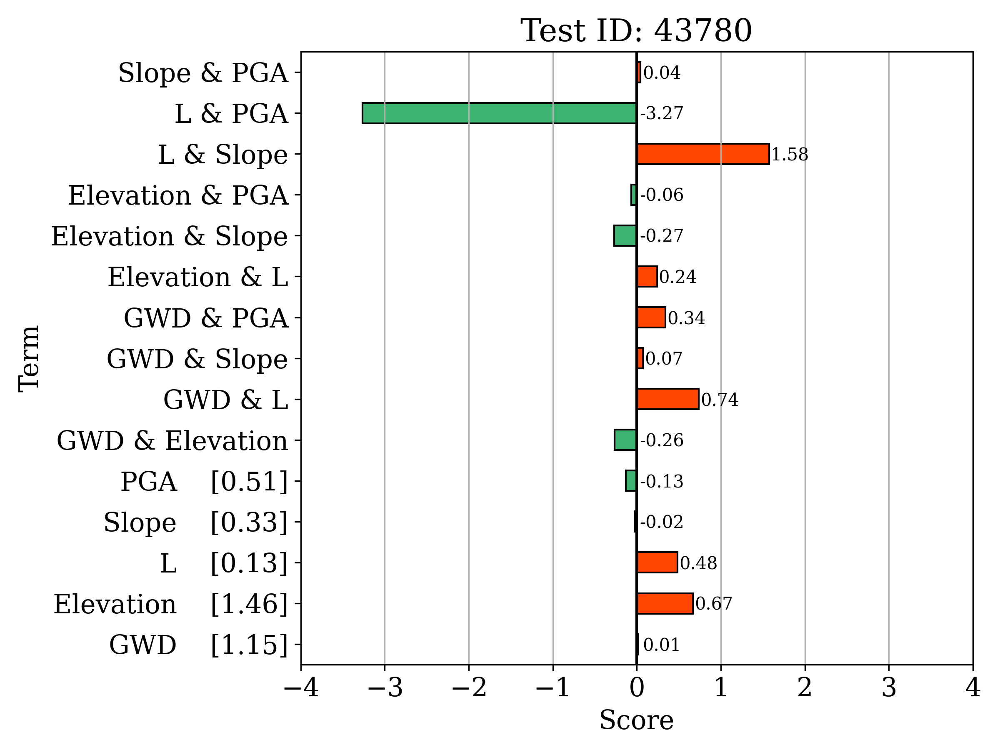
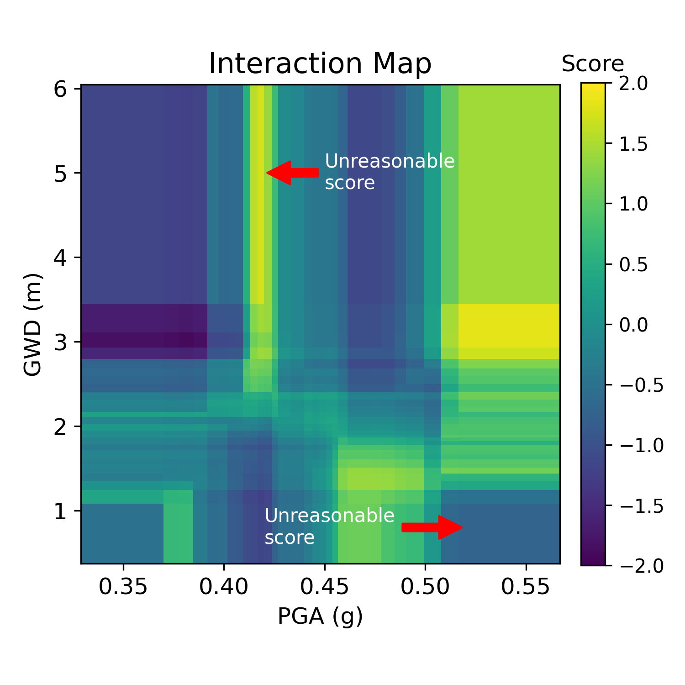
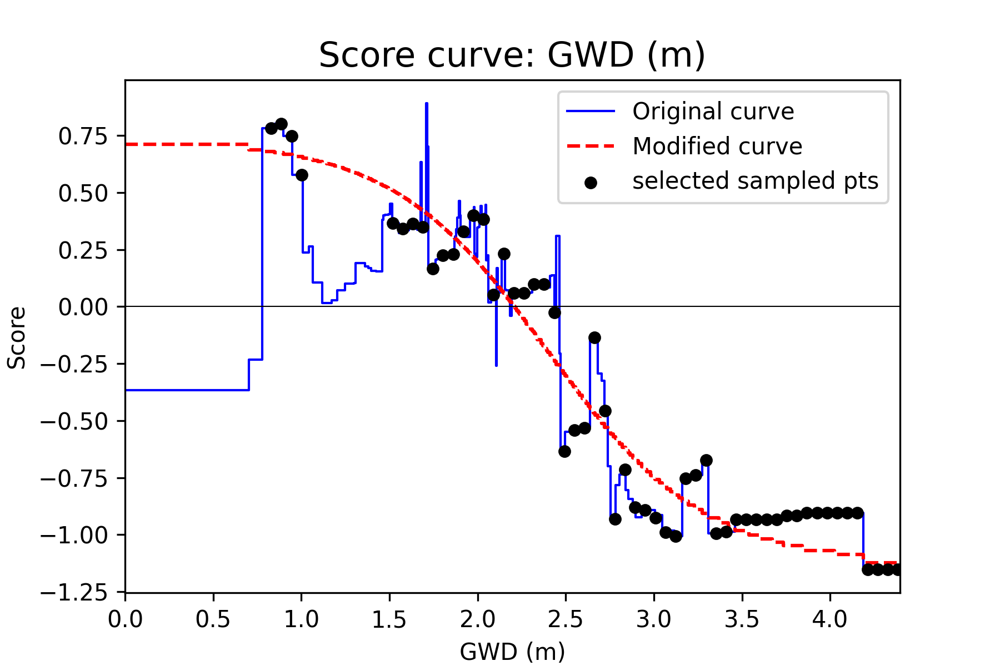

# Domain-Informed Explainable Boosting Machines for Trustworthy Lateral Spreading Prediction

This repository contains the implementation and experiments for:

**Domain-Informed Explainable Boosting Machines for Trustworthy Lateral Spreading Prediction**

The goal of this work is to incorporate **domain knowledge** into Explainable Boosting Machines (EBM) to improve the **physical consistency and trustworthiness** of lateral spreading predictions.

---

# Installation

## 1. Clone the repository

```bash
git clone https://github.com/chhsiao93/di-ebm-lateral-spreading.git
cd di-ebm-lateral-spreading
```

## 2. Installation

```bash
conda create -n di-ebm python=3.9.9
conda activate di-ebm
pip install -r requirements.txt
```

## 3. Register env and launch Jupyter notebook

```bash
python -m ipykernel install --user --name di-ebm --display-name "Python (di-ebm)"
jupyter notebook
```

---

# Dependencies

The project was tested with:
```bash
Python 3.9.9
interpret==0.5.0
```
The version of interpret is pinned because EBM default parameter changes in different version.

# Results

Explainable Boosting Machines (EBM) provide fully transparent predictions.  
For a given input, the predicted score can be computed by **summing the contributions from each feature and feature interaction**, as represented by the learned shape functions.

These shape functions are visualized as charts, which together constitute the complete EBM model. Because the model is represented explicitly by these charts, engineers can directly examine how each feature (or feature pair) contributes to the final prediction.

<p align="center">

</p>

This transparency also makes it possible to identify **physically inconsistent behaviors** in the learned shape functions.  
For example, the interaction map below reveals regions where the model exhibits trends that contradict domain knowledge.

<p align="center">

</p>

Since the EBM model can be fully represented by these charts, our approach is to **modify the regions that exhibit unphysical behavior** according to domain knowledge. This adjustment improves the **physical consistency and trustworthiness** of the model while retaining the interpretability of EBM.

<p align="center">

</p>


